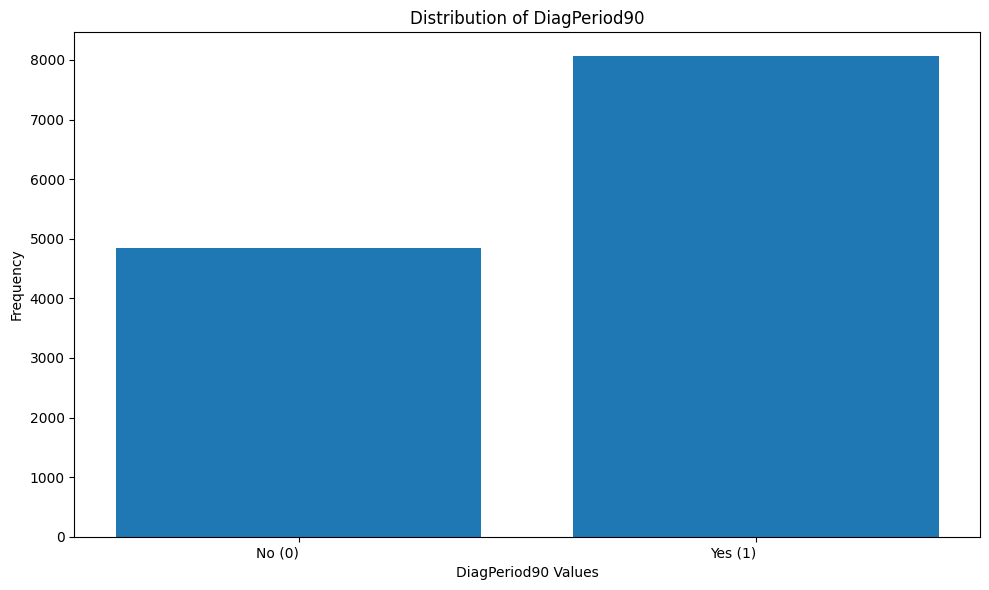
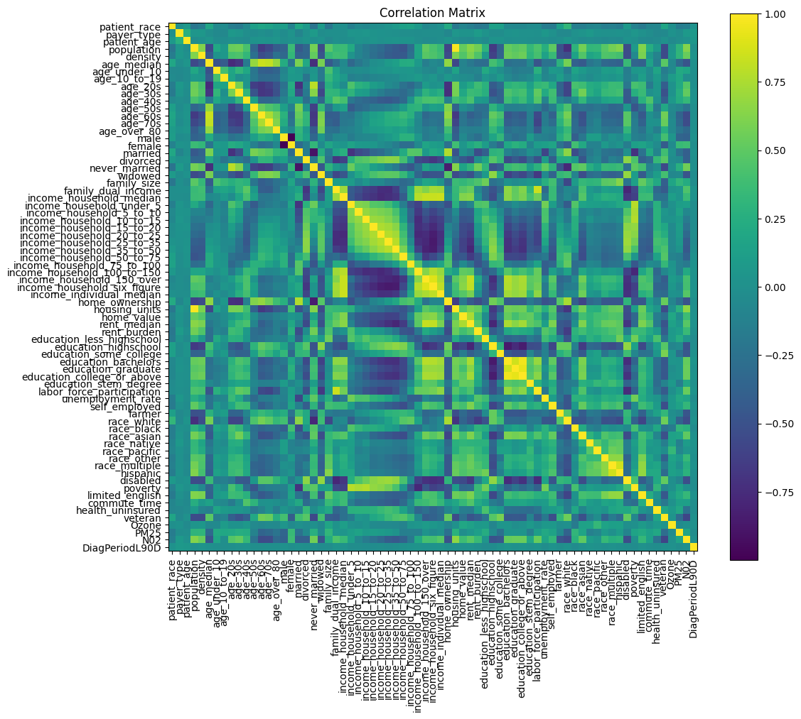

# Predicting Metastatic Cancer Diagnosis within 90 Days

* **One Sentence Summary** This repository contains a classification project for predicting whether a patient will receive a metastatic cancer diagnosis within 90 days using demographic, clinical, and socioeconomic data. **LINK** (https://www.kaggle.com/c/widsdatathon2024-challenge1/overview) 

## Overview
  * **Definition of the tasks / challenge**  The goal is to assess whether the likelihood of the patient’s Diagnosis Period being less than 90 days is predictable using these characteristics and information about the patient
  * **Your approach** We formulated this as a binary classification task using models like Random Forest, Decision Tree, and XGBoost. We evaluated model performance based on ROC-AUC and F1-score, while handling class imbalance using SMOTE 
  * **Summary of the performance achieved** The XGBoost achieved the best performance with an ROC-AUC of approximately 0.58 on validation data. The Random Forest model also performed well, followed by the Decision Tree classifier.

## Summary of Workdone
### Data

* Data:
  * Type: Tabular CSV file with mixed numeric and categorical columns. Each row represents a patient.
    * Input: Patient demographics, ZIP-level socioeconomic indicators, diagnostic codes, insurance status, and more
    * Output: Binary label indicating diagnosis within 90 days ("DiagPeriodL90D").
    * training.csv: ~15,000 samples with 35 features
    * test.csv: ~5,000 samples with similar structure (without labels)
      
#### Preprocessing / Clean up

* Dropped high-missing and leakage-prone columns such as diagnosis descriptions, treatment codes, and patient IDs.
* Encoded categorical variables using Label Encoding.
* Filled missing numeric values using median imputation.
* Handled class imbalance using SMOTE 

#### Data Visualization

 * Unbalance with more (1)

### Problem Formulation

* Define:
  * Input: Tabular features per patient
  * Output: Binary label (0 = no diagnosis within 90 days, 1 = diagnosis)
  * Models:
    * Random Forest (baseline, robust to noise)
    * Decision Tree (simple and interpretable)
    * XGBoost (optimized gradient boosting)
  * Loss:Binary Cross-Entropy (logloss)
  * Metrics: ROC-AUC, F1-score, Precision, Recall

### Training
  *  All models trained on Google Colab using Python 3.11 and Scikit-learn/XGBoost.
  * Used 70/15/15 split for training/validation/test.
  * Hyperparameter tuning was performed using GridSearchCV.
  * How did you decide to stop training.
  * Any difficulties? How did you resolve them?

### Performance Comparison
  ### ROC Curve Comparison

### Conclusions

* XGBoost offered the best performance in terms of ROC-AUC and F1.
* Class imbalance and feature noise were key challenges.
* Feature selection and probability threshold tuning helped improve recall.

### Future Work
  * Incorporate external healthcare usage data.
  * Try neural nets with embeddings for categorical variables.
  * Other machine learning techniques to address imbalancing like ADSYN

## How to reproduce results
  * clone the repo and install packages
  * Load training.csv, preprocess, and train using the Kaggle_Challenge-3.ipynb notebook.
  * Run models and evaluate using included code blocks.
  * Use submission_example.csv as a template for creating test set predictions

### Software Setup
  * Python 3.11
  * Required packages: pandas, numpy, scikit-learn, xgboost, matplotlib

### Data
  * Provided by the competition organizers.
  * https://www.kaggle.com/c/widsdatathon2024-challenge1/data
  * Under Summary there is a button that will automatically download the files

### Training
  * Perform a stratified 70/15/15 split on the preprocessed dataset

#### Performance Evaluation
  * Metrics: ROC-AUC, Precision, Recall, F1
